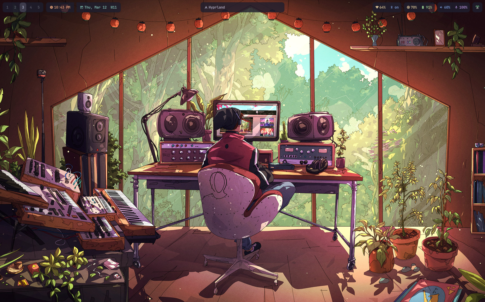
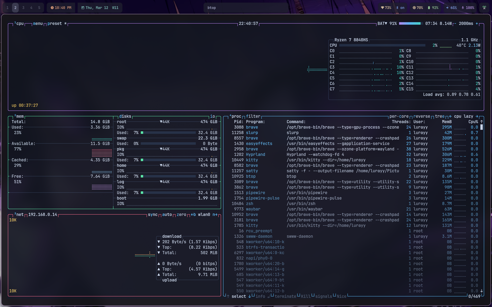
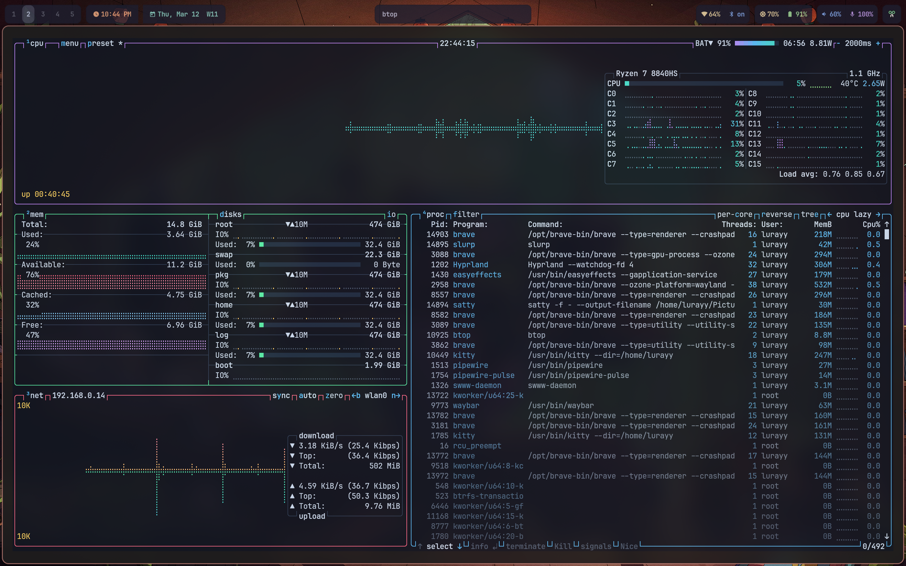
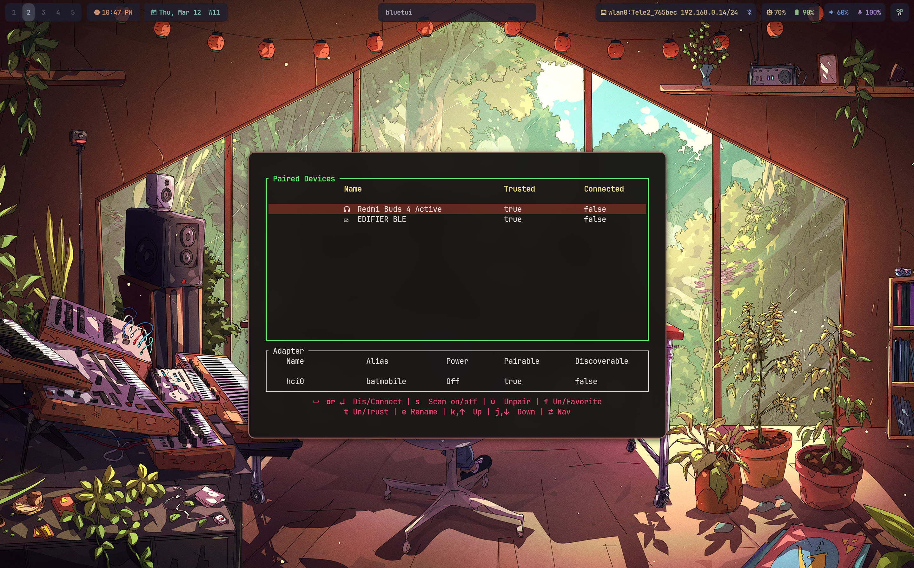

<h1 align="center">
  <br>
<<<<<<< HEAD
  Chill Dots
=======
  chill-dots
>>>>>>> a6a955c (added more configs)
  <br>
</h1>

<h4 align="center">A complete Hyprland rice for Arch Linux with automatic wallpaper-based theming.</h4>

<p align="center">
  <a href="#screenshots">Screenshots</a> •
  <a href="#features">Features</a> •
  <a href="#whats-included">What's Included</a> •
  <a href="#installation">Installation</a> •
  <a href="#auto-theming">Auto Theming</a> •
  <a href="#keybindings">Keybindings</a>
</p>

---

## Screenshots

<p align="center">
  
  
</p>
<p align="center">
  
  
</p>
<p align="center">
  
</p>

> Every screenshot above uses the **same config** — the only difference is the wallpaper. Colors are generated automatically.

---

## Features

- **Auto-theming** — [wallust](https://codeberg.org/explosion-mental/wallust) extracts a 16-color palette from your wallpaper and applies it across your entire desktop in real-time
- **Wallpaper rotation** — systemd timer swaps wallpapers every 20 minutes with smooth [swww](https://github.com/LGFae/swww) transitions, re-theming everything automatically
- **106 curated wallpapers** included out of the box
- **Custom animations** — bezier-curved window open/close, smooth workspace transitions, animated borders
- **Blur & transparency** — layered blur with vibrancy on panels, launchers, and lock screen
- **Weather in your bar** — live weather module in [Waybar](https://github.com/Alexays/Waybar)
- **One-command install** — backs up your existing configs, installs everything, and applies the theme

---

## What's Included

| Component | Tool | Description |
|-----------|------|-------------|
| Window Manager | [Hyprland](https://hyprland.org/) | Tiling Wayland compositor with animations & blur |
| Status Bar | [Waybar](https://github.com/Alexays/Waybar) | Customizable bar with weather, system stats, workspaces |
| Terminal | [Kitty](https://sw.kovidgoyal.net/kitty/) / [Ghostty](https://ghostty.org/) | GPU-accelerated terminals |
| App Launcher | [Walker](https://github.com/abenz1267/walker) | Wayland-native application launcher |
| Notifications | [Mako](https://github.com/emersion/mako) | Lightweight Wayland notification daemon |
| Wallpaper | [swww](https://github.com/LGFae/swww) + [Waypaper](https://github.com/anufrievroman/waypaper) | Smooth transitions + GUI wallpaper picker |
| Auto-theming | [wallust](https://codeberg.org/explosion-mental/wallust) | Color extraction & template system |
| Shell | [Oh My Zsh](https://ohmyz.sh/) + [Starship](https://starship.rs/) | Zsh with autosuggestions, syntax highlighting, git prompt |
| OSD | [SwayOSD](https://github.com/ErikReider/SwayOSD) | On-screen display for volume/brightness |
| Lock Screen | [Hyprlock](https://github.com/hyprwm/hyprlock) | Hyprland-native lock screen |
| Idle Daemon | [Hypridle](https://github.com/hyprwm/hypridle) | Auto-lock & screen off on idle |
| Theme Base | [Omarchy](https://omarchy.dev/) | Base theme layer |

<details>
<summary><strong>Full package list (176 official + 3 AUR)</strong></summary>

Official packages are listed in `pkglist-official.txt` and AUR packages in `pkglist-aur.txt`. Key categories:

- **Dev tools** — neovim, git, docker, lazygit, lazydocker, nodejs, python, rust, ruby
- **Browsers** — chromium, firefox, brave (AUR)
- **Media** — obs-studio, kdenlive, mpv, ffmpeg, imagemagick
- **Apps** — obsidian, signal-desktop, spotify, libreoffice
- **CLI utilities** — btop, eza, bat, fzf, ripgrep, fd, tldr, jq, tmux
- **Fonts** — JetBrains Mono Nerd Font, Noto (CJK + Emoji)

</details>

---

## Installation

### Prerequisites

- **Arch Linux** with an active internet connection
- **[Omarchy](https://omarchy.dev/)** installed first

### Steps

```bash
# Clone the repo
git clone https://github.com/kabir0st/chill-dots.git
cd chill-dots

# Run the installer
chmod +x install.sh
./install.sh
```

The installer will:

1. Install all packages (official + AUR via [yay](https://github.com/Jguer/yay))
2. Back up your existing configs to `~/.config-backup-<timestamp>/`
3. Copy 106 wallpapers to `~/Pictures/Wallpapers/`
4. Deploy all config files to `~/.config/`
5. Set up Oh My Zsh with plugins (autosuggestions, syntax highlighting, autoswitch-virtualenv)
6. Enable systemd services (wallpaper rotation + audio)
7. Apply the default theme and generate initial color scheme

After installation, **log out and back in** (or reboot). If your monitors look wrong, edit `~/.config/hypr/monitors.conf`.

---

## Auto Theming

The auto-theming system is the core of this rice. Here's how it works:

```
┌─────────────┐     ┌─────────┐     ┌──────────────────────┐
│  Wallpaper   │────▶│ wallust │────▶│  Template Engine      │
│  (any image) │     │ kmeans  │     │  7 config templates   │
└─────────────┘     └─────────┘     └──────────┬───────────┘
                                               │
                    ┌──────────────────────────┐│
                    │  Live-updated configs:    ││
                    │  ├─ Hyprland (borders)    │◀
                    │  ├─ Waybar (panel)        │
                    │  ├─ Kitty (terminal)      │
                    │  ├─ Mako (notifications)  │
                    │  ├─ Walker (launcher)     │
                    │  ├─ Starship (prompt)     │
                    │  └─ Shell env vars        │
                    └──────────────────────────┘
```

**wallust** uses k-means clustering to extract a 16-color dark palette from the current wallpaper. It then renders 7 template files that inject those colors into every themed application — no restart needed.

### Trigger methods

| Trigger | What happens |
|---------|-------------|
| **Automatic** (every 20 min) | systemd timer picks a random wallpaper → sets it with swww → runs wallust → reloads all apps |
| **Manual switch** | `Super + W` opens Waypaper GUI → pick a wallpaper → colors regenerate |
| **Omarchy theme change** | The `theme-set` hook re-runs wallust so colors stay in sync |

### Configuration

The wallust config lives at `configs/wallust/wallust.toml`:

```toml
backend = "kmeans"        # Color extraction algorithm
color_space = "labmixed"  # Perceptual color space
palette = "dark16"        # 16-color dark palette
check_contrast = true     # Ensure readability
threshold = 11            # Minimum contrast ratio
```

Templates are in `configs/wallust/templates/` — edit these to customize how colors map to each application.

---

## Keybindings

| Key | Action |
|-----|--------|
| `Super + Enter` | Open terminal (Kitty) |
| `Super + Alt + Enter` | Tmux session |
| `Super + Shift + Return` | Open browser |
| `Super + Shift + W` | Wallpaper picker (Waypaper) |
| `Super + Shift + R` | Random wallpaper |
| `Super + Shift + S` | Screenshot (select area) |
| `Super + V` | Clipboard history (CopyQ) |
| `Super + E` | File manager |
| `Super + Shift + M` | Spotify |
| `Super + Shift + N` | Editor |
| `Super + Shift + D` | Lazydocker |
| `Super + Shift + O` | Obsidian |

Full keybindings are in `configs/hypr/bindings.conf`.

---

## Structure

```
chill-dots/
├── install.sh              # One-command installer
├── pkglist-official.txt    # 176 official Arch packages
├── pkglist-aur.txt         # 3 AUR packages
├── configs/
│   ├── hypr/               # Hyprland (WM, animations, blur, bindings)
│   ├── wallust/            # Auto-theming engine + 7 color templates
│   ├── waybar/             # Status bar + weather script
│   ├── kitty/              # Terminal config
│   ├── ghostty/            # Alt terminal config
│   ├── mako/               # Notification daemon
│   ├── starship/           # Shell prompt
│   ├── walker/             # App launcher
│   ├── swayosd/            # On-screen display
│   ├── waypaper/           # Wallpaper manager
│   └── omarchy/            # Theme hooks & menu extensions
├── shell/
│   └── .zshrc              # Zsh config with Oh My Zsh
├── systemd/                # Wallpaper rotation timer + services
├── wallpapers/             # 106 curated wallpapers
└── screenshots/
```

---

<p align="center">
  Built on <a href="https://hyprland.org/">Hyprland</a> + <a href="https://omarchy.dev/">Omarchy</a> + <a href="https://codeberg.org/explosion-mental/wallust">wallust</a> on Arch Linux
</p>
